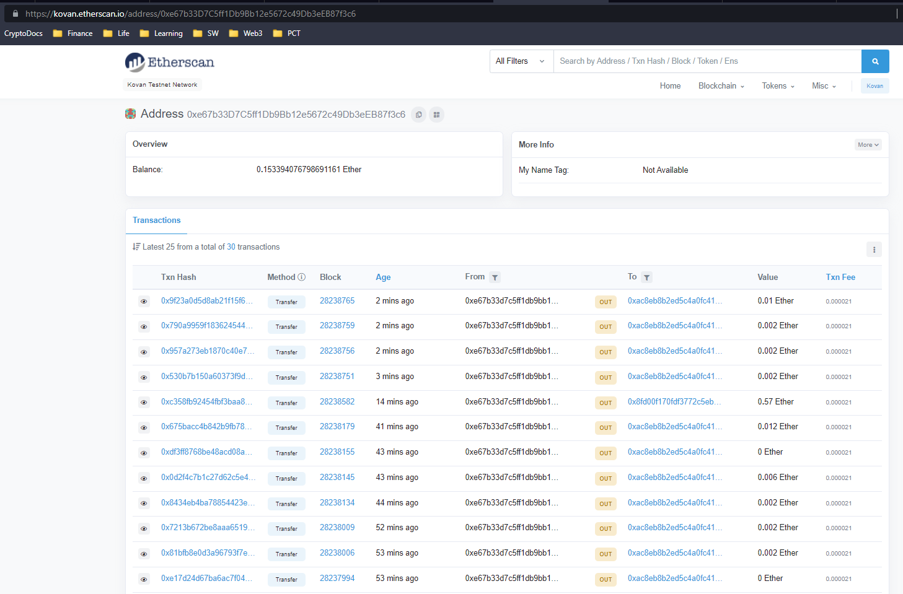
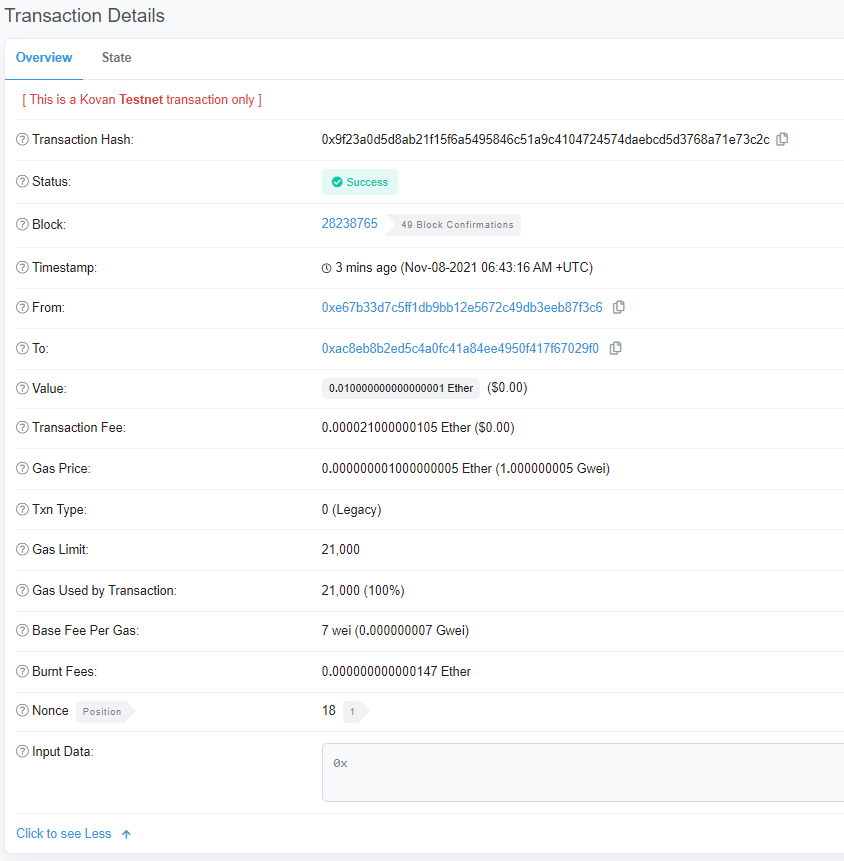
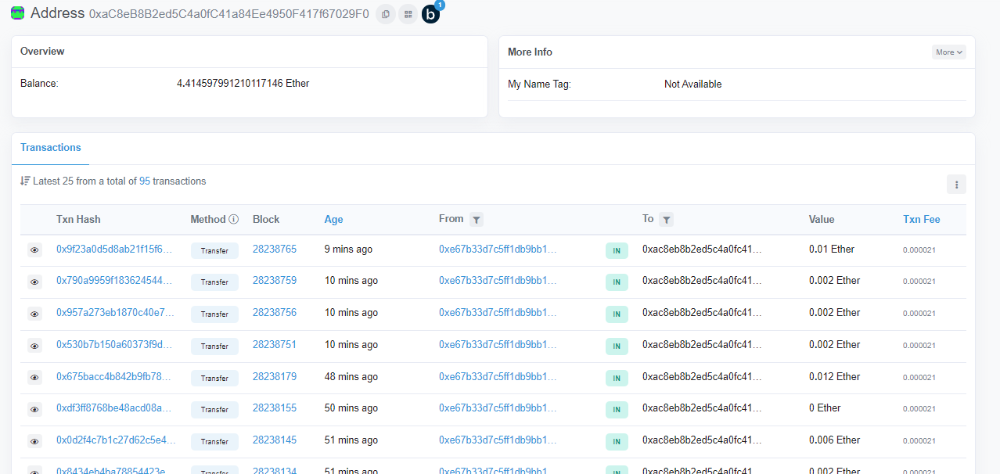

# <a id="Top-of-Page"> Welcome to the Web3 Ether Talent Pool!</a>
#### A web app for hiring and transacting on the Ethereum blockchain.

***
## <a id="Contents">Cotents</a>
[Project Description](#Project-Description) 
[Technologies](#Technologies) 
[Installation Guide](#Installation-Guide) 
[Usage](#Usage) 
[Contributors](#Contributors) 
[License](#License) 
[Bottom of Page](#Bottom-of-Page) 

***
## <a id="Project-Description">Project Description</a>
This project, provides an interface for sourcing Web3 development talent. The Web3 Ether Talent Pool project provides the Fintech Finder page. This page allows clients to identify talent, specify the work demand, and transact compensation via the cryptocurrency Ether.

#### A summary of what's under the hood:    
This project utilizes the Python library <a href="https://web3py.readthedocs.io/en/stable/" target="_blank">Web3.py</a>, for interacting with Ethereum. This library is used to provide blockchain references and lookups, execute transactions, and update costs and balances.

The Fintech Finder page is generated with the <a href="https://streamlit.io/" target="_blank">streamlit</a> web app framework to provide an accurate and responsive utility for selecting talent.

#### Project layout:
The layout of essentials for this project is show below.
. 
├── .env 
├── crypto_wallet.py 
├── fintech_finder.py 
├── img 
│   ├── 19-0-infura-sign-up.png 
│   ├── ash.jpeg 
│   ├── client-etherscan-kovan.png 
│   ├── jo.jpeg 
│   ├── kendall.jpeg 
│   ├── lane-etherscan-kovan.png 
│   ├── lane.jpeg 
│   ├── transaction-etherscan-kovan.png 
│   └── web-app.png 
├── LICENSE 
├── README.md 
├── requirements.txt 
├── SAMPLE.env 
├── setup.py 
├── static 
│   ├── fintech-01.jpg 
│   └── style.py 
├── streamlit_custom_components 
│   ├── copycontent_button 
│   │   ├── frontend 
│   │   │   └── build 
│   │   │       ├── asset-manifest.json 
│   │   │       ├── bootstrap.min.css 
│   │   │       ├── index.html 
│   │   │       ├── precache-manifest.7d28d4f1dd06fe1528c46b815edd1fb6.js 
│   │   │       ├── service-worker.js 
│   │   │       └── static 
│   │   │           └── js 
│   │   │               ├── 2.bd9b94bf.chunk.js 
│   │   │               ├── 2.bd9b94bf.chunk.js.LICENSE.txt 
│   │   │               ├── 2.bd9b94bf.chunk.js.map 
│   │   │               ├── main.5ac0fb29.chunk.js 
│   │   │               ├── main.5ac0fb29.chunk.js.map 
│   │   │               ├── runtime-main.547c5a5e.js 
│   │   │               └── runtime-main.547c5a5e.js.map 
│   │   ├── test.py 
│   │   └── __init__.py 
│   └── crypto_account_stack 
│       ├── frontend 
│       │   └── build 
│       │       ├── asset-manifest.json 
│       │       ├── bootstrap.min.css 
│       │       ├── index.html 
│       │       ├── precache-manifest.e4affc5c9aa6a411f03be436b6d71409.js 
│       │       ├── service-worker.js 
│       │       └── static 
│       │           └── js 
│       │               ├── 2.bd102428.chunk.js 
│       │               ├── 2.bd102428.chunk.js.LICENSE.txt 
│       │               ├── 2.bd102428.chunk.js.map 
│       │               ├── main.453cc1a2.chunk.js 
│       │               ├── main.453cc1a2.chunk.js.map 
│       │               ├── runtime-main.eab36c2e.js 
│       │               └── runtime-main.eab36c2e.js.map 
│       ├── test.py 
│       └── __init__.py 
└── tree.txt 

**Note:** <code>.env</code> is only a refernece to show how and where it should be in the project structure. Please use <code>SAMPLE.env</code> as a reference template for your own <code>.env</code> file.

***
## <a id="Technologies">Technologies</a>
<a href="https://docs.python.org/release/3.8.0/" title="https://docs.python.org/release/3.8.0/">

 
<a href="requirements.txt" title="requirements.txt">Requirements List</a>  
In addition to the Python installation requirements, you will also need to open an account with Infura API. To create an Infura account, navigate to the Infura website's <a href="https://infura.io/register" target="_blank">registration page</a>, then register for an account, as shown in the following image: 

***
## <a id="Installation-Guide">Installation Guide</a>
### Project Installation
To install <a href="https://github.com/jasonjgarcia24/web3-ether-talent-pool" title="https://github.com/jasonjgarcia24/web3-ether-talent-pool">web3-ether-talent-pool</a>, type <code>git clone https://github.com/jasonjgarcia24/web3-ether-talent-pool.git</code> into bash in your prefered local directory.  
Alternatively, you can navigate to the same address (<code>https://github.com/jasonjgarcia24/web3-ether-talent-pool.git</code>) and download the full <code>main</code> branch's contents as a zip file to your prefered local directory. 

### Setting Environment Variables
A <code>.env</code> file is required for use with the <a href="https://alpaca.markets/" target="_blank">Infura API</a>. The Infura API will facilitate blockchain transactions over the Ethereum network.

| Environment                               | Description                |
| ----------------------------------------- | -------------------------- |
| MNEMONIC=&lt;mnemonic&gt;                 | Your Client's ETH Mnemonic |
| WEB3_INFURA_PROJECT_ID=&lt;secret_key&gt; | Your Infura Project ID     |

***
## <a id="Usage">Usage</a>
This web app interface is shown below: 
 

When navigating to the client's account on <a href="https://kovan.etherscan.io/" target="_blank">Kovan Etherscan</a>, we can see related transactions: 
 
    
Additionally, on the Kovan Etherscan page, we can see the corresponding transactions: 
 
    
And finally, we can also view the account of the recipient (our Fintech professional): 

***
## <a id="Contributors">Contributors</a>
Currently just me :) 

***
## <a id="License">License</a>
Each file included in this repository is licensed under the <a href="https://github.com/jasonjgarcia24/web3-ether-talent-pool/blob/e0f0508e2d1a41c32d608373a7d796601ee42daa/LICENSE" title="github.com/jasonjgarcia24/financial-planning-tools/blob/main/LICENSE">MIT License.</a>

***
[Top of Page](#Top-of-Page) 
[Contents](#Contents) 
[Project Description](#Project-Description) 
[Technologies](#Technologies) 
[Installation Guide](#Installation-Guide) 
[Usage](#Usage) 
[Contributors](#Contributors) 
[License](#License) 

